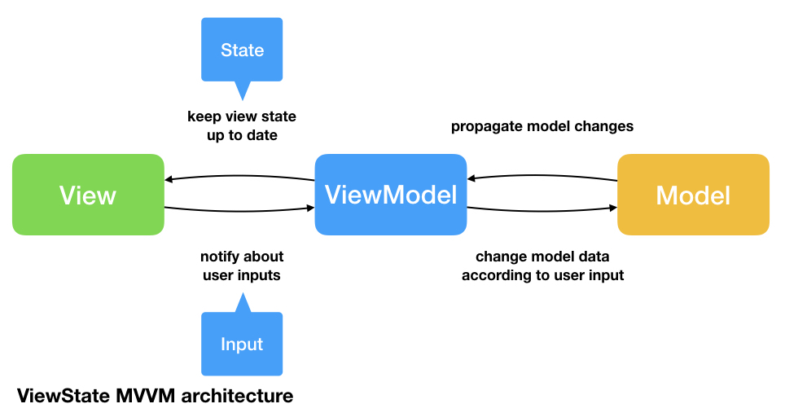

# Diplomado de Desarrollo de Aplicaciones Móviles **5ta Generación**

### Lecture Log

- [Session 1 (14/02/2020)](sessions/session_1/README.md)

### Resources

1. Books and guides
   1. [Guía Swift](resources/swiftessentials.pdf)
   2. [Swift Book](https://books.goalkicker.com/SwiftBook/)
   3. [iOS Book](https://books.goalkicker.com/iOSBook/)
   4. [Git Reference](resources/guides/5220423-dzone-rc94-gettingstartedwithgit.pdf)
   5. [Design Patterns](resources/guides/6848282-rc0008-designpatterns-online.pdf)
   6. [Swift cheatsheet](resources/guides/RW-Swift-Cheatsheet-0_8.pdf)
   7. [Hábitos de los usuarios de internet en México](resources/guides/15+Estudio+sobre+los+Ha_bitos+de+los+Usuarios+de+Internet+en+Me_xico+2019+versio_n+pu_blica.pdf)
   8. [Human Interface Guidelines](https://developer.apple.com/design/human-interface-guidelines/)
   
### References
1.- Model View Controller Pattern

2.- Model View ViewModel

### Telegram group
- https://t.me/joinchat/G9xsYBYFlbn0UB1tF2uWlw